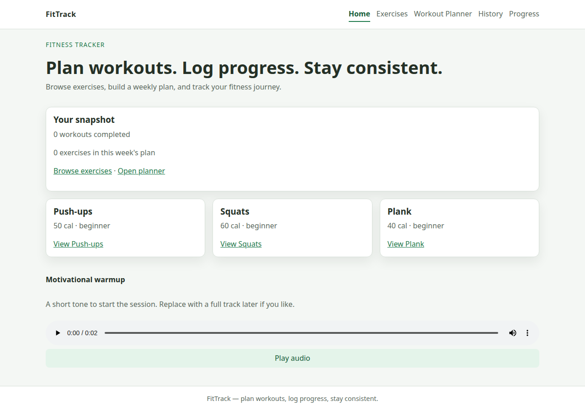
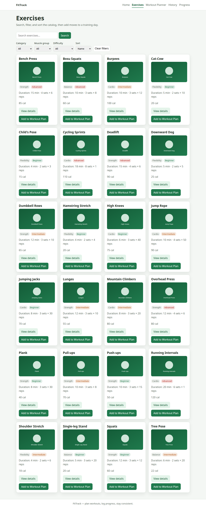
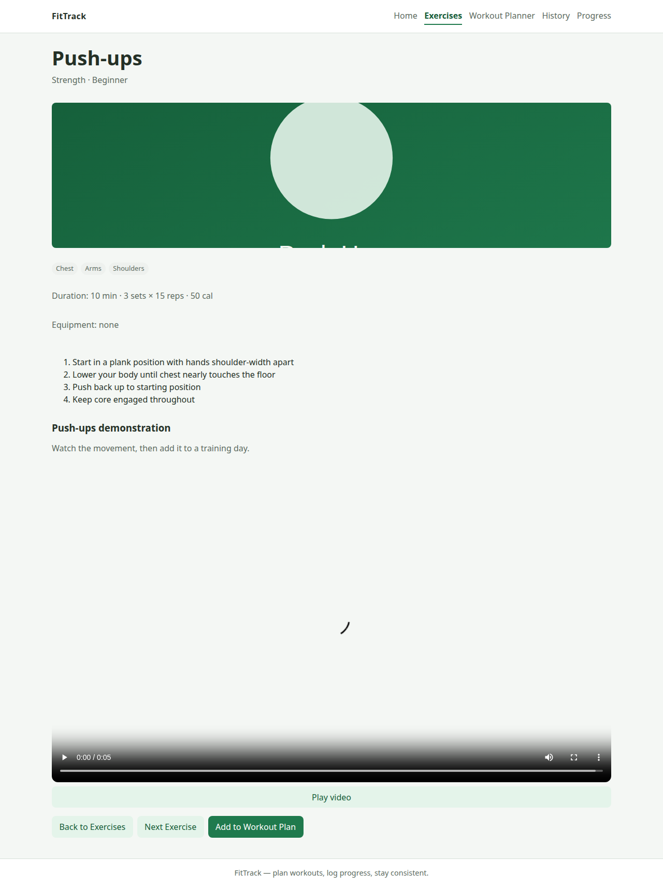
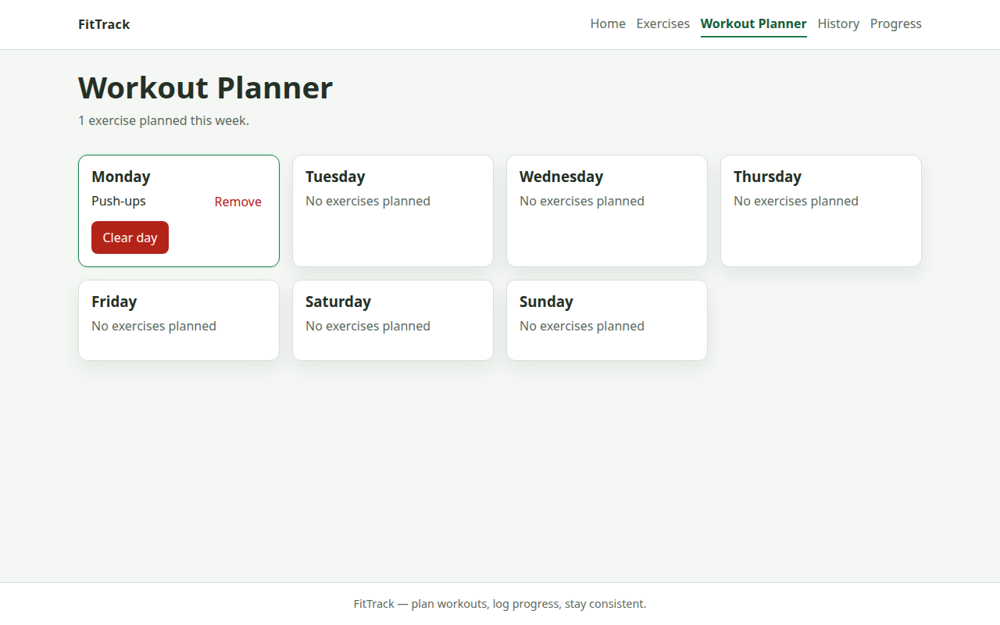
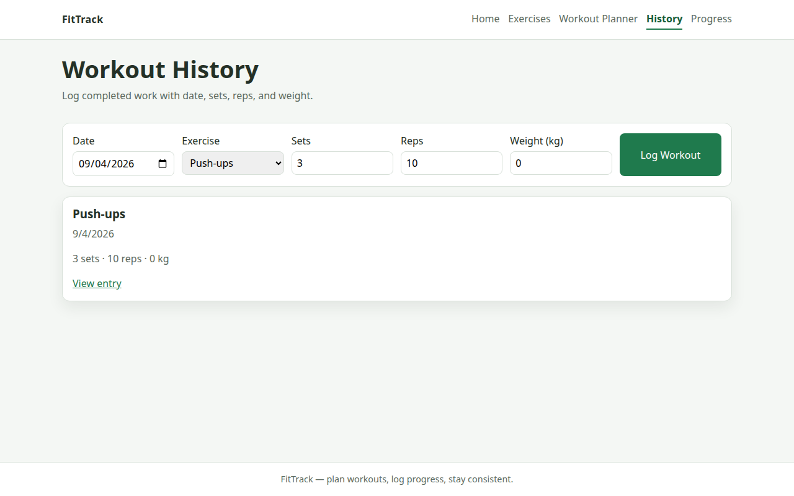
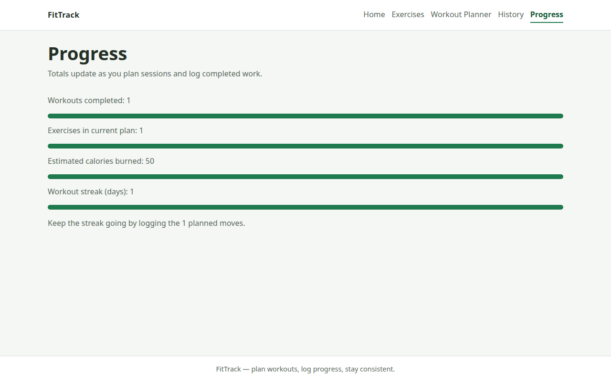
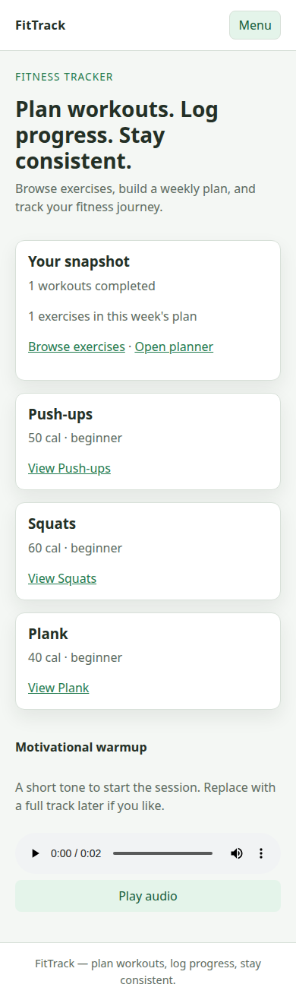
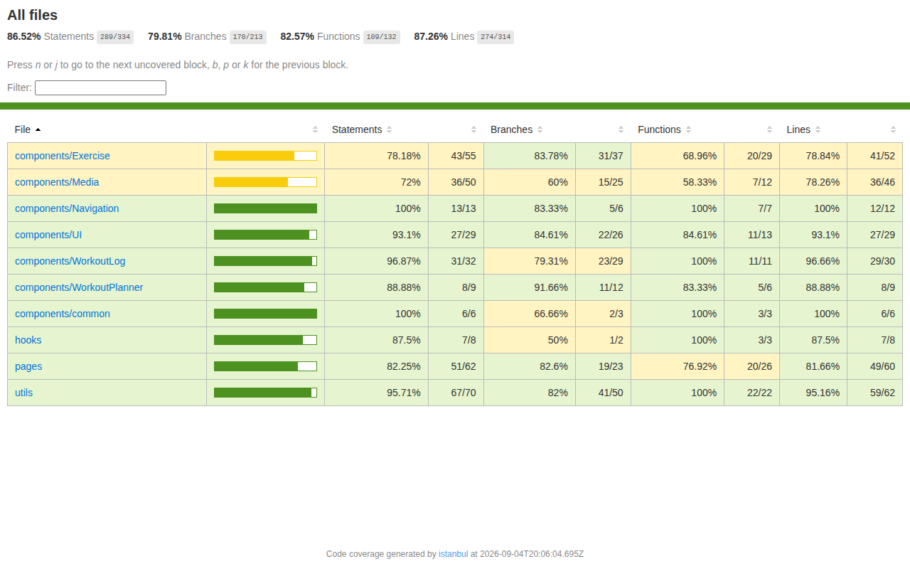

# FitTrack

FitTrack is a React fitness tracker and weekly workout planner. Members search a 24-exercise catalog, watch form demos, add moves to Monday–Sunday, log completed work, and review streak and calorie totals.

## Features

- Search, filter, and sort by category, muscle group, and difficulty
- Exercise detail with instructions and a demonstration video
- Motivational audio on the home page
- Weekly planner with add, remove, and clear-day actions
- Workout logging (date, sets, reps, weight)
- Progress totals, estimated calories, and streak
- Persistent plan and history in `localStorage`
- Responsive navigation and a 404 page

## Technologies

React 19, Vite, React Router 8, PropTypes, Vitest (Jest-compatible), React Testing Library, CSS Modules.

## Installation

```bash
npm install
npm start          # same as npm run dev
npm test
npm test -- --coverage
```

Open the printed local URL (usually `http://localhost:5173`).

## Project structure

`src/components` holds feature folders (Navigation, Exercise, WorkoutPlanner, WorkoutLog, Media, UI, common). `src/pages` holds route screens. `src/data` is the catalog. `src/utils` and `src/hooks` hold helpers and `useLocalStorage`. Tests sit beside the files they cover. Placeholder images, video, and audio live in `public/assets`.

## Components

- **Navbar / Footer / Header / Loading** — shell and status
- **ExerciseCard, ExerciseList, ExerciseFilter, ExerciseDetail** — catalog and form video
- **WorkoutPlanner, DayCard** — seven-day plan
- **WorkoutLog, LogEntry, ProgressChart** — history and totals
- **VideoPlayer, AudioPlayer** — HTML5 media with play/pause
- **Button, Card, SearchBar, Modal, Badge** — reusable UI

## State management

`App` lifts `workoutPlan` and `workoutHistory` so Exercises, Planner, History, Home, and Progress stay in sync. Filters live on `ExercisesPage`. `useLocalStorage` writes both stores. Child callbacks (`onAddToPlan`, `onRemoveExercise`, `onLogWorkout`) send updates back up.

## Routing

`/` Home · `/exercises` catalog · `/exercises/:id` detail · `/workout-planner` week · `/history` logs · `/history/:entryId` entry · `*` 404. Navbar marks the active route. Detail and 404 use programmatic navigation.

## Testing strategy

43 tests: component render/props/clicks, integration (navigation and add-then-log), hook persistence, loading/empty/error, async catalog load, and mocked handlers. Vitest + React Testing Library, Jest-style APIs.

## Test coverage

Latest `npm test -- --coverage` run:

| Metric | Coverage |
| --- | --- |
| Statements | 86.52% |
| Branches | 79.81% |
| Functions | 82.57% |
| Lines | 87.26% |

All 43 tests passed. HTML report: `coverage/index.html`. Screenshot: `screenshots/coverage.png`.

## Future enhancements

User accounts, real trainer videos, rest-day suggestions, and exportable weekly PDFs.

## Screenshots









